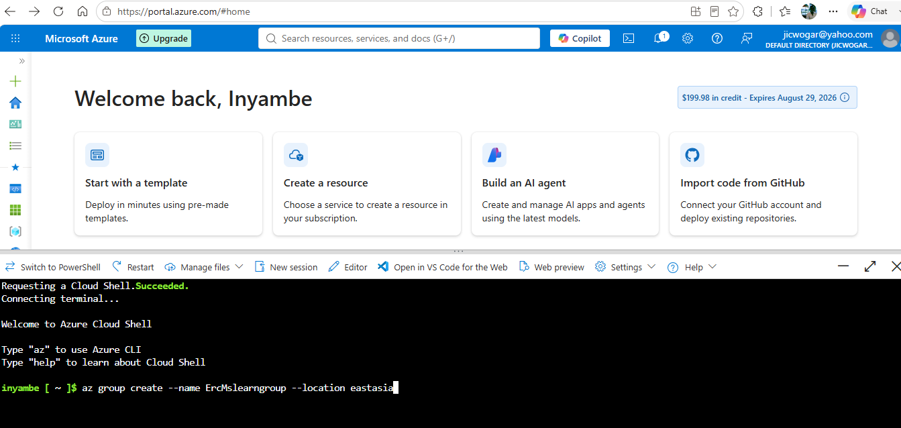
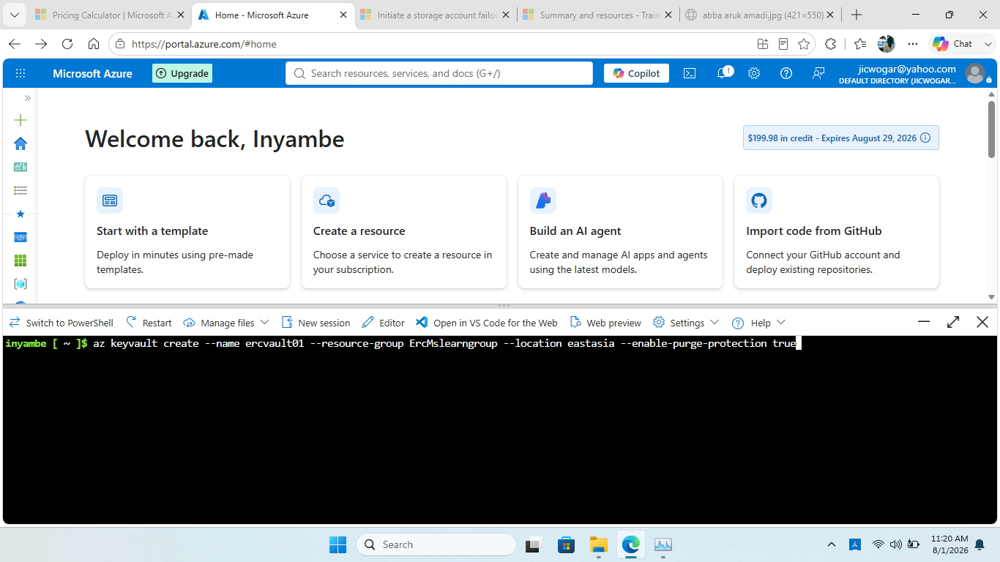
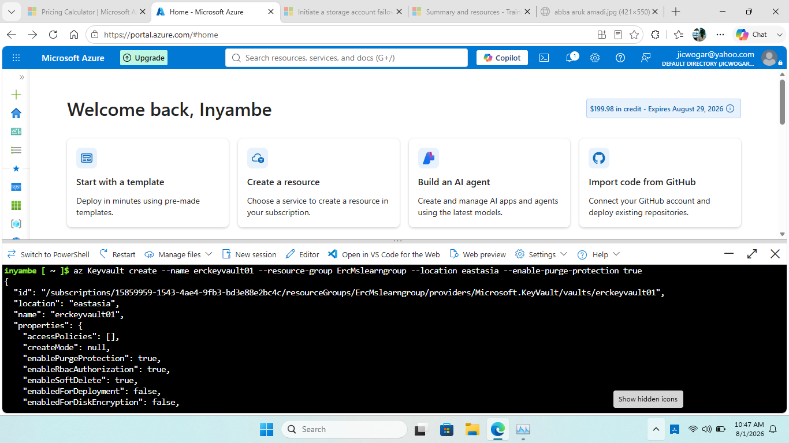
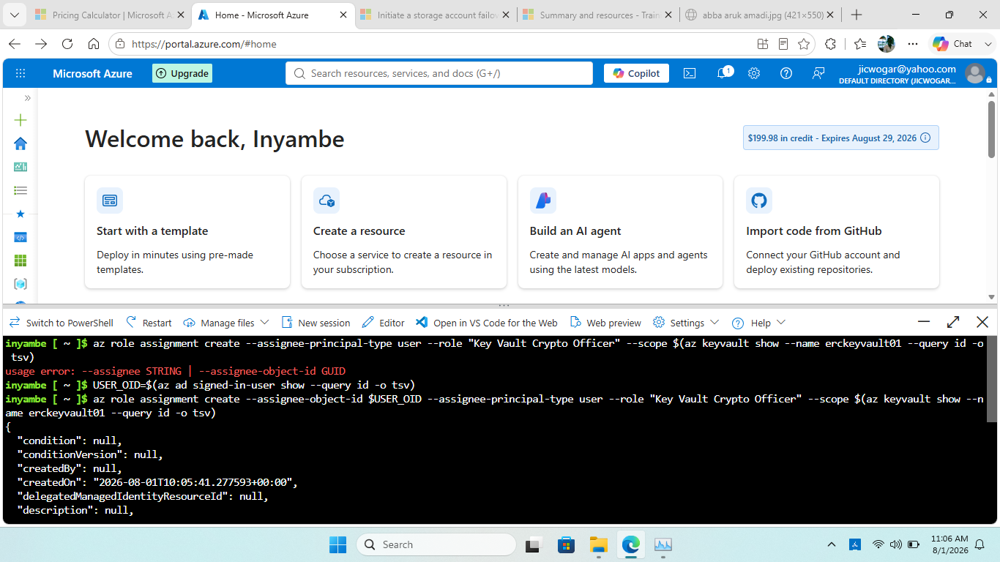
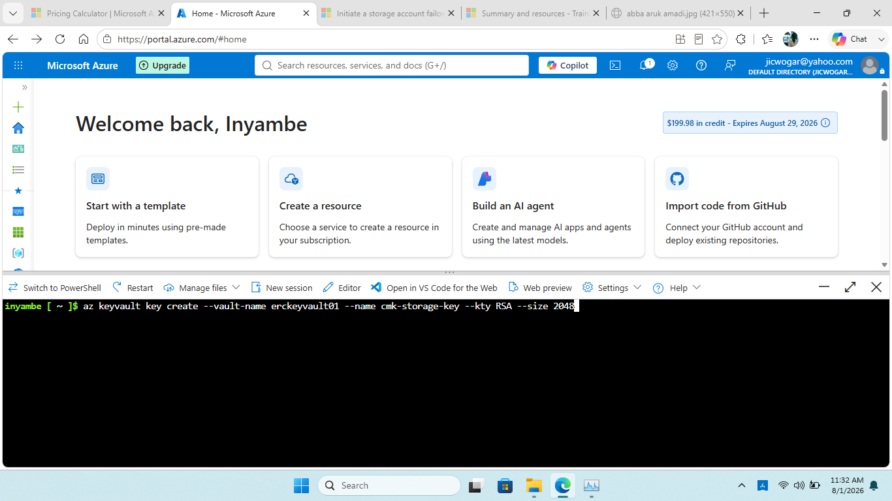
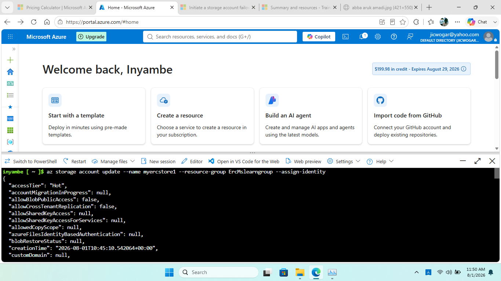
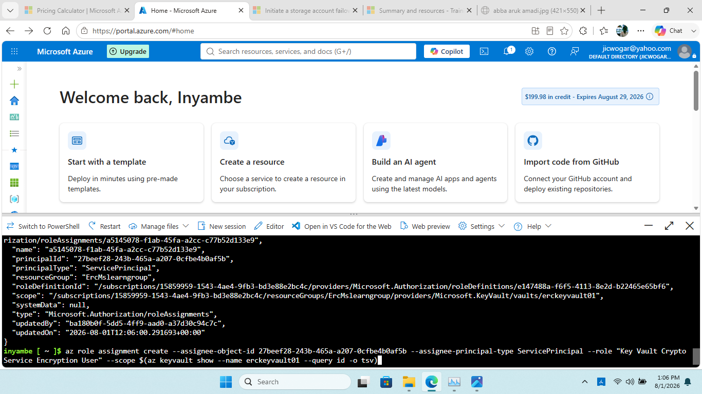
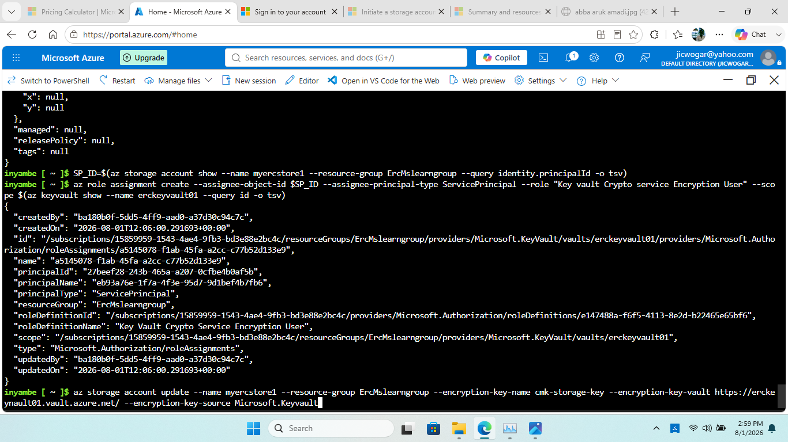
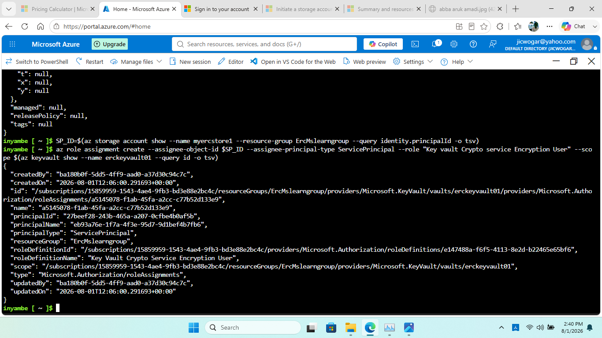
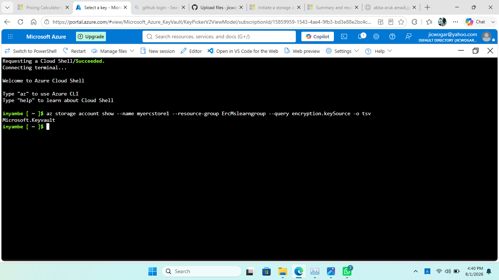

# Azure Customer-Managed Keys (CMK) Implementation

## Overview

This project demonstrates how to configure **Customer-Managed Keys (CMK)** for an Azure Storage Account using **Azure Key Vault**, **RSA encryption keys**, **managed identity**, and **Azure RBAC**.

The implementation shows how an organization can maintain greater control over encryption keys used to protect data at rest.

## Architecture

```text
Azure Storage Account
        |
        | uses
        v
Managed Identity
        |
        | authorized through Azure RBAC
        v
Azure Key Vault
        |
        | protects
        v
RSA Customer-Managed Key
```

## Prerequisites

- Active Azure subscription
- Azure Portal access
- Azure CLI or Azure Cloud Shell
- Permission to create Storage Accounts, Key Vaults, keys, managed identities, and role assignments
- Basic knowledge of Azure RBAC and managed identities

## Implementation Steps

### Step 1 — Create the Resource Group

Create a dedicated resource group for the CMK implementation.

```bash
az group create --name <resource-group-name> --location <azure-region>
```



### Step 2 — Create the Storage Account

Create the Azure Storage Account that will use the customer-managed key.



### Step 3 — Create the Key Vault

Create an Azure Key Vault to securely store and manage the RSA encryption key.



### Step 4 — Grant Account Permissions

Grant the required permissions to create and manage encryption keys. Use Azure RBAC according to the principle of least privilege.



### Step 5 — Create the RSA Key

Create an RSA key in Key Vault. This key will be used as the customer-managed encryption key.



### Step 6 — Configure the Managed Identity

Configure the Storage Account with a managed identity so it can authenticate to Azure Key Vault without storing credentials.



### Step 7 — Obtain the Principal ID

Obtain the managed identity's principal ID. This identifier is used when assigning Azure RBAC permissions.


### Step 8 — Assign the Key Vault Role

Assign the appropriate Key Vault role to the managed identity so it can perform the required cryptographic operations.



### Step 9 — Configure Customer-Managed Key Encryption

Configure the Storage Account to use the RSA key stored in Key Vault as its customer-managed encryption key.



### Step 10 — Assign the Service Identity Role

Assign the required role to the Storage Account's service identity so it can access and use the customer-managed key.



### Step 11 — Verify the Configuration

Verify that the Storage Account is successfully configured to use the customer-managed key.

Confirm that:

- The Key Vault exists and is accessible.
- The RSA key is enabled.
- The managed identity is correctly configured.
- Required RBAC assignments exist.
- Customer-managed encryption is enabled.



## ARM Template

The repository also contains an ARM template for the CMK implementation.

Example Azure CLI deployment:

```bash
az deployment group create \
  --resource-group <resource-group-name> \
  --template-file "<path-to-template>.json"
```

Replace the placeholders with your actual resource group and ARM template path.

## Security Considerations

This implementation demonstrates:

- Managed identity instead of stored credentials
- Azure RBAC for authorization
- Azure Key Vault for centralized key management
- Principle of least privilege
- Separation of encryption-key management from the Storage Account
- Customer control over the encryption-key lifecycle

## Technologies Used

- Azure Storage Account
- Azure Key Vault
- Customer-Managed Keys (CMK)
- RSA encryption keys
- Managed Identity
- Azure RBAC
- Azure CLI
- ARM templates
- Azure Portal
- Data-at-rest encryption

## Repository Structure

The screenshots are currently stored in the **root of the repository**, so the image links below deliberately use direct relative paths.

```text
Azure-Customer-Managed-Keys-CMK-Implementation/
│
├── README.md
├── 01-create-resource-group.png
├── 02-create-storage-account.png
├── 03-create-key-vault.png
├── 04-grant-account-permissions.png
├── 05-create-rsa-key.png
├── 06-configure-managed-identity.png
├── 07-get-principal-id.png
├── 08-assign-key-vault-role.png
├── 09-configure-cmk.png
├── 10-assign-service-identity-role.png
├── 11-verify-key-vault.png
└── arm template for Az CMK Implementation
```

## Learning Objective

This project provides practical experience with Azure security, storage encryption, Key Vault, managed identities, RBAC, customer-managed keys, Azure CLI, and infrastructure as code.

## Author

**Jicwogar**

Azure Cloud / Infrastructure & Security Practice Project
